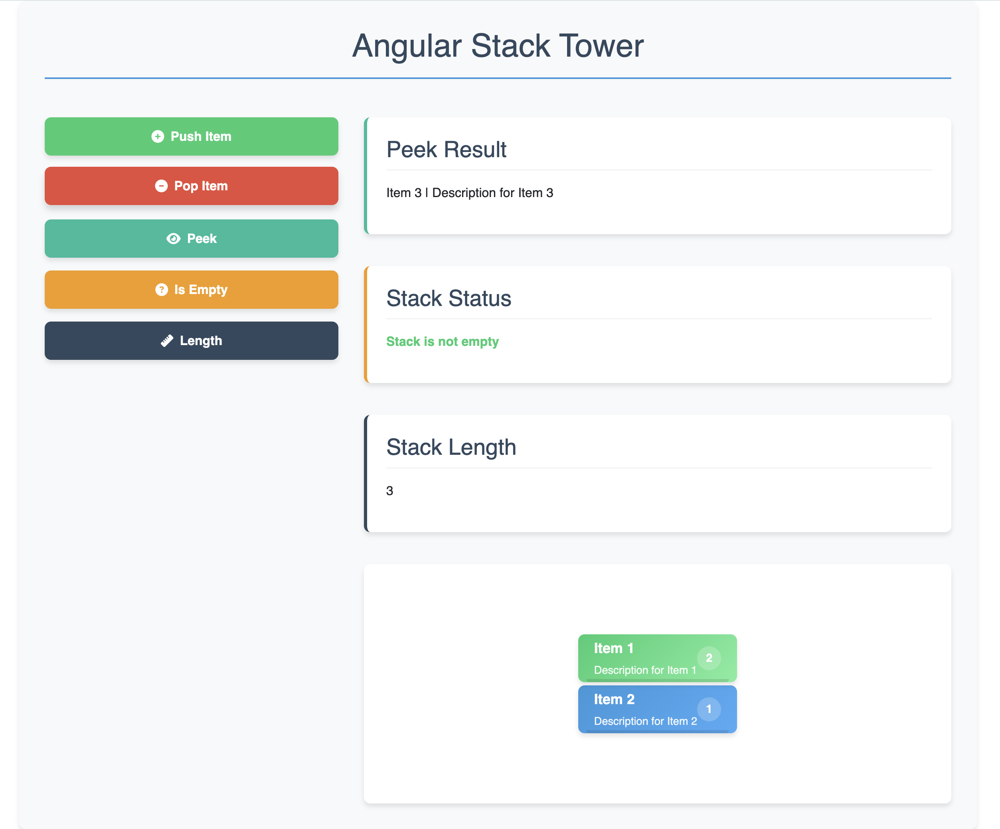

# Angular Stack Tower

A Tower of Hanoi puzzle game built with Angular. This interactive web application allows users to solve the classic Tower of Hanoi puzzle with customizable difficulty levels.

## 🎮 Preview



## ✨ Features

- Interactive Tower of Hanoi puzzle implementation
- Multiple difficulty levels (3-7 disks)
- Move counter and timer
- Best score tracking
- Responsive design for desktop and mobile
- Animated disk movements
- Game reset and restart functionality

## 🚀 Getting Started

### Prerequisites

- Node.js (v14.x or later)
- npm (v6.x or later)

### Installation

1. Clone the repository:

```bash
git clone https://github.com/atikur0786/angular-stack-tower.git
```

2. Navigate to the project directory:

```bash
cd angular-stack-tower
```

3. Install dependencies:

```bash
npm install
```

4. Start the development server:

```bash
ng serve
```

5. Open your browser and navigate to `http://localhost:4200/`

## 🛠️ Built With

- [Angular](https://angular.io/) - The web framework used
- [TypeScript](https://www.typescriptlang.org/) - Programming language

## 📝 How to Play

1. The objective is to move all disks from the leftmost tower to the rightmost tower.
2. Only one disk can be moved at a time.
3. No disk may be placed on top of a smaller disk.
4. Use drag and drop or click to select and place disks.

## 🧪 Running Tests

Run unit tests with:

```bash
ng test
```

Run end-to-end tests with:

```bash
ng e2e
```

## 📱 Responsive Design

The game is fully responsive and works on:

- Desktop browsers
- Tablets
- Mobile devices

Project Link: [https://github.com/atikur0786/angular-stack-tower](https://github.com/atikur0786/angular-stack-tower)
